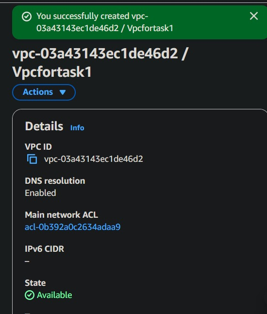
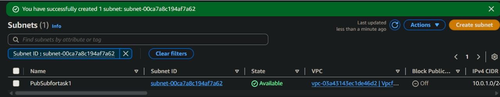
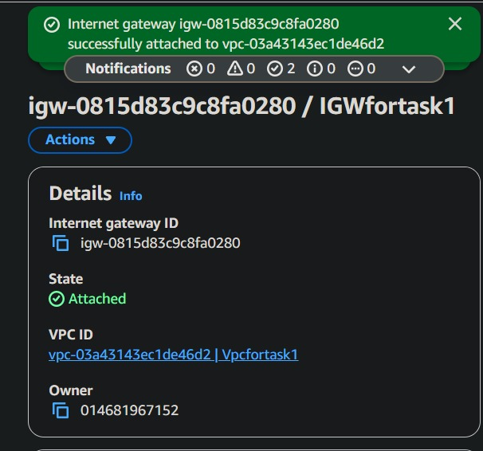
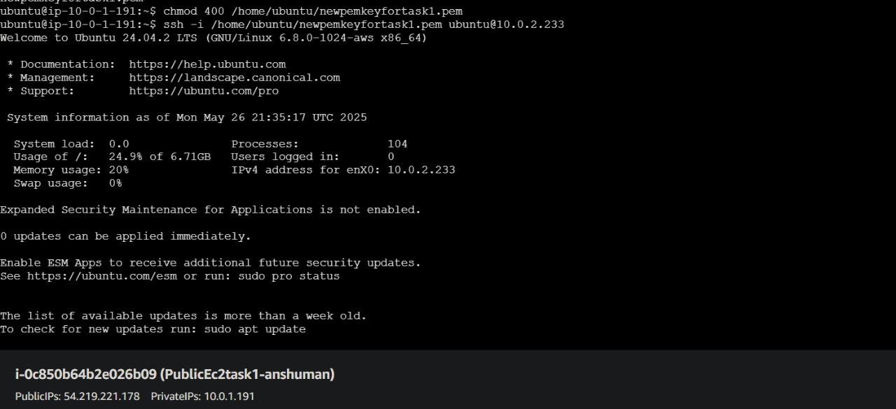

# Task 1: Establish Connectivity to Private EC2 Instance from Public EC2 (Bastion Host)

## 📋 Overview
Amazon EC2 provides scalable virtual servers in AWS cloud. In production environments, private EC2 instances require secure access through a **Bastion Host** - a hardened public EC2 instance acting as a secure gateway.

## 🏗️ Architecture
- **Bastion Host**: Public subnet + Internet Gateway (IGW)
- **Target Instance**: Private subnet (no direct internet access)
- **Access Flow**: Local machine → Bastion Host → Private EC2

---

## 🚀 Implementation Steps

### 1️⃣ VPC Configuration

### 2️⃣ Subnet Setup

#### Public Subnet

#### Private Subnet

### 3️⃣ Internet Gateway Deployment

### 4️⃣ SSH Connection to Private Instance
