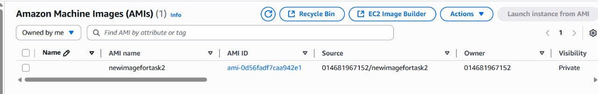
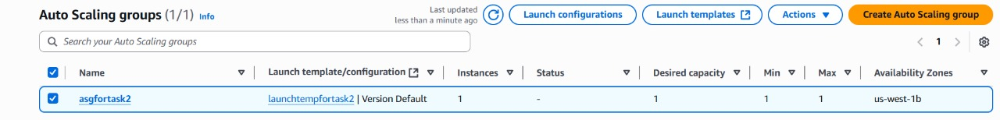

# Task 2: Establish Auto Scaling using ASG

## Overview

Amazon EC2 (Elastic Compute Cloud) provides scalable virtual machines. However, manual EC2 instance management is inefficient for dynamic workloads. **Auto Scaling** automates infrastructure adaptation to varying demand.

## Auto Scaling Groups (ASGs)

**Auto Scaling Groups (ASGs)** maintain a defined number of EC2 instances based on configured conditions, such as:
- CPU utilization
- Network traffic
- Custom metrics

To ensure application availability and responsiveness, ASGs automatically scale instances **in** (add) or **out** (remove) to meet the desired capacity.

## Implementation Process

### 1. Amazon Machine Image (AMI)
The process begins with creating an **Amazon Machine Image (AMI)** - a template containing the software configuration for your EC2 instances:
- Operating System
- Application server
- Applications

### 2. Launch Configuration
**Launch Configurations** or **Launch Templates** are defined, specifying parameters for instances launched by the ASG:
- Instance type
- AMI
- Key pair
- Security groups

### 3. CloudWatch Integration
ASGs utilize Amazon **CloudWatch** alarms as triggers for scaling policies, responding to real-time metrics:

**Scale Out Example:**
- CPU utilization > 80% for specified period
- ASG automatically provisions new instances

**Scale In Example:**
- CPU utilization < threshold
- ASG terminates surplus instances to optimize costs

---

## Implementation Screenshots

### 1) AMI Creation

### 2) ASG Creation
