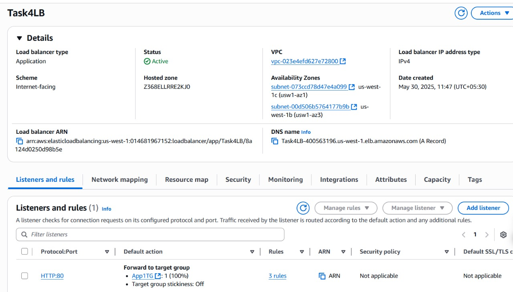
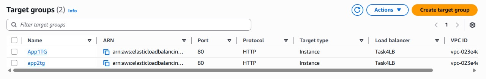
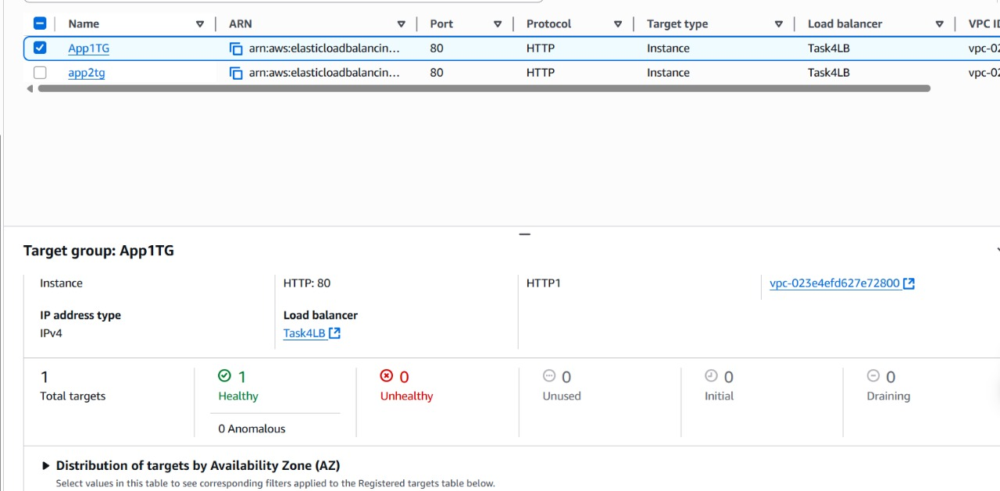
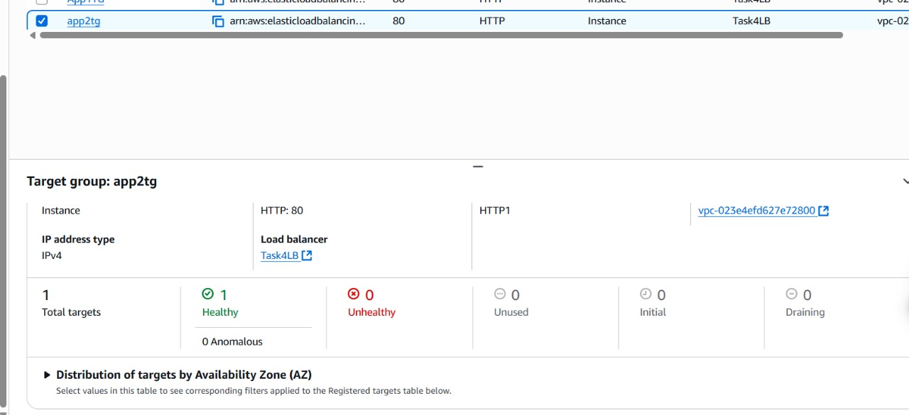

# Task 3: Application Load Balancer-Based Path-Based Routing

## Overview

AWS **Application Load Balancer (ALB)** is a Layer 7 load balancer that routes HTTP/HTTPS traffic based on request attributes such as:
- URL path
- Host headers  
- Query strings

**Path-Based Routing** is a key feature that directs traffic to different target groups based on the URL path of incoming requests.

## How It Works

For example, if applications are hosted at `/app1` and `/app2`, the ALB can route requests to distinct backend resources, like EC2 instances, for each path.

### Configuration Process

1. **Create an ALB** with listener rules that inspect the request path
2. **Define routing rules** that forward traffic to specific *Target Groups* based on path:
    - `/app1/*` → Target Group 1
    - `/app2/*` → Target Group 2
3. **Configure target groups** containing EC2 instances, Lambda functions, or other resources

### Backend Configuration

Backend servers, such as *Nginx*, are configured on the target instances to serve content for their respective paths:
- Instance 1 serves `/app1`
- Instance 2 serves `/app2`
- Each application is hosted on separate EC2 instances

## Benefits

*Path-Based Routing* enables:
- ✅ Optimized traffic distribution
- ✅ Application tier isolation  
- ✅ Improved scalability
- ✅ Efficient infrastructure utilization

---

## Implementation Results

### 1) ALB Configuration

### 2) Target Groups for Each Instance

### 3) Target Group Health Checks

### 4) Result: Path-Based Routing in Action
The `index.html` page is served by the appropriate instance after ALB routes traffic based on the URL path.
