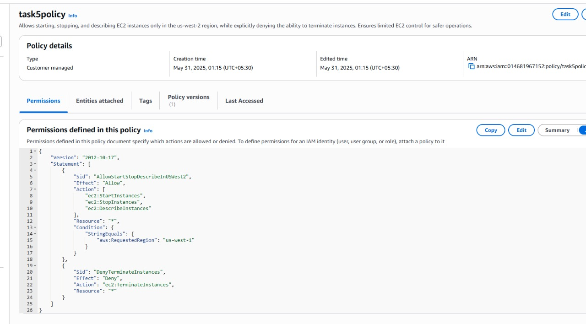

# Task 5: Implement a Custom IAM Policy for EC2 Instance Control

This task outlines the creation of a custom AWS Identity and Access Management (IAM) policy designed for precise control over Amazon EC2 instances. The core objective is to grant users permissions to manage the operational state (start, stop) and monitor (describe) EC2 instances, while explicitly denying the ability to terminate them. All defined actions are confined to the `us-west-1` region.

## Key Components

### ✅ Allowed Actions
- **`ec2:StartInstances`** - Enables users to start specified EC2 instances
- **`ec2:StopInstances`** - Enables users to stop specified EC2 instances  
- **`ec2:DescribeInstances`** - Allows users to retrieve information about EC2 instances, crucial for monitoring and operational awareness

### ❌ Denied Actions
- **`ec2:TerminateInstances`** - Explicitly blocks the termination of EC2 instances, providing a critical safeguard against accidental or unauthorized deletions

### 🌍 Regional Constraint
A condition is applied to ensure that the `ec2:StartInstances`, `ec2:StopInstances`, and `ec2:DescribeInstances` actions are effective only within the **`us-west-1`** AWS region. This helps maintain regional data governance and control.

## Benefits

Attaching this policy to IAM users or roles enforces the **principle of least privilege**. It balances essential operational capabilities for EC2 instance management with robust security measures, specifically preventing irreversible termination actions and restricting operations to a designated AWS region.

## IAM Policy Implementation

