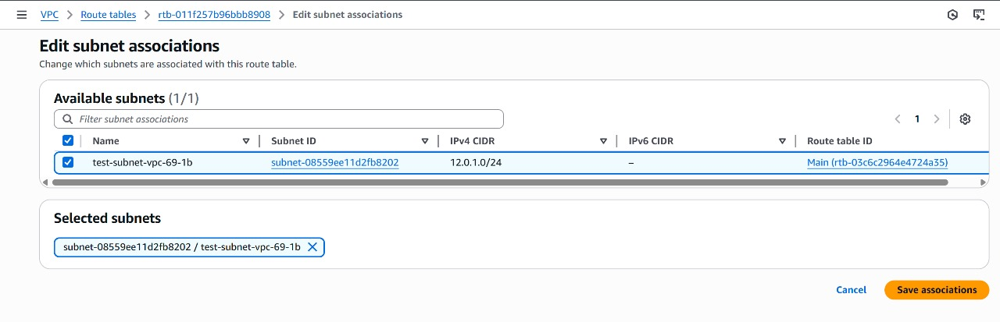

# Task 6: Cross-Account VPC Peering Implementation

## Overview
This task demonstrates establishing **VPC Peering** connections between Virtual Private Clouds (VPCs) across different AWS accounts to enable secure, private network communication without internet gateway routing.

## Architecture Benefits
- **Enhanced Security**: Private communication bypassing public internet
- **Reduced Latency**: Direct network paths between VPCs
- **Cost Optimization**: Eliminates NAT gateway requirements for cross-VPC traffic
- **Multi-Account Isolation**: Maintains account-level resource separation

## Implementation Steps

### 1. VPC Infrastructure Setup

*Create isolated VPCs in separate AWS accounts with non-overlapping CIDR blocks*

### 2. Route Table Configuration

*Configure custom route tables for granular traffic control*

### 3. Subnet Provisioning

*Deploy subnets across multiple AZs for high availability*

### 4. Subnet Association

*Associate subnets with appropriate route tables*

### 5. Internet Gateway Attachment

*Enable internet connectivity for public subnets*

### 6. Route Configuration

*Update route tables to direct traffic through peering connection*

### 7. Gateway Verification

*Confirm internet gateway operational status*

### 8. EC2 Instance Deployment

*Launch instances in respective VPCs for connectivity testing*

### 9. Peering Connection Request

*Initiate cross-account VPC peering connection*

### 10. Peering Connection Acceptance

*Accept peering request and establish connection*

### 11. Connectivity Validation

*Verify bidirectional SSH connectivity between instances via private IPs*

## Key Configuration Requirements
- **CIDR Block Planning**: Ensure non-overlapping IP ranges
- **Security Groups**: Configure inbound/outbound rules for required protocols
- **Route Tables**: Add peering connection routes in both VPCs
- **DNS Resolution**: Enable DNS hostname resolution for cross-VPC communication
